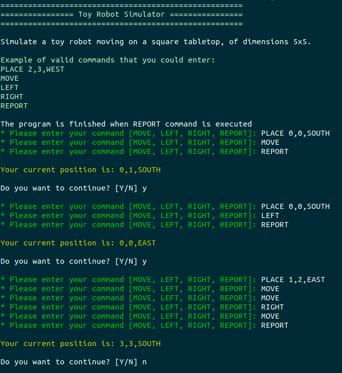
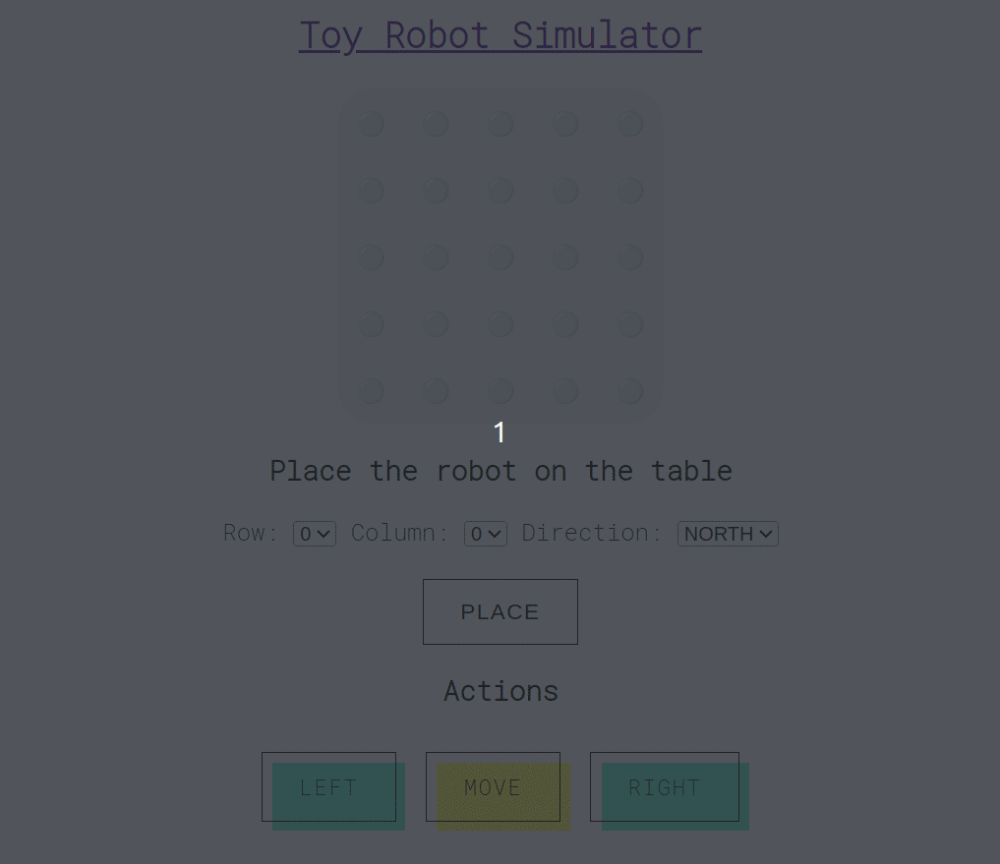

# Simulador Robô de Brinquedo

Esta aplicação consiste em simular um robô de brinquedo movendo-se sobre uma mesa de 5x5.

## Iniciando a aplicação:

### Interface de linha de comando (CLI):

Pré-requisitos
* Ter ruby instalado na sua máquina
* Ter o colorize e o dry-monads instalado. Caso não tenha rode:

```bash
sudo gem install colorize
sudo gem install dry-monads
```

Executando a aplicação:
```bash
ruby app/scripts/terminal_interface.rb
```



### Interface Web:

Primeiramente, é necessário rodarmos o build do docker para configurar o ambiente:

```bash
docker compose -f docker/local/compose.yml build
```

Em seguida vamos subir nossa aplicação rodando:

```bash
docker compose -f docker/local/compose.yml up
```

Feito isso, podemos acessar a aplicação em http://localhost:3000/


